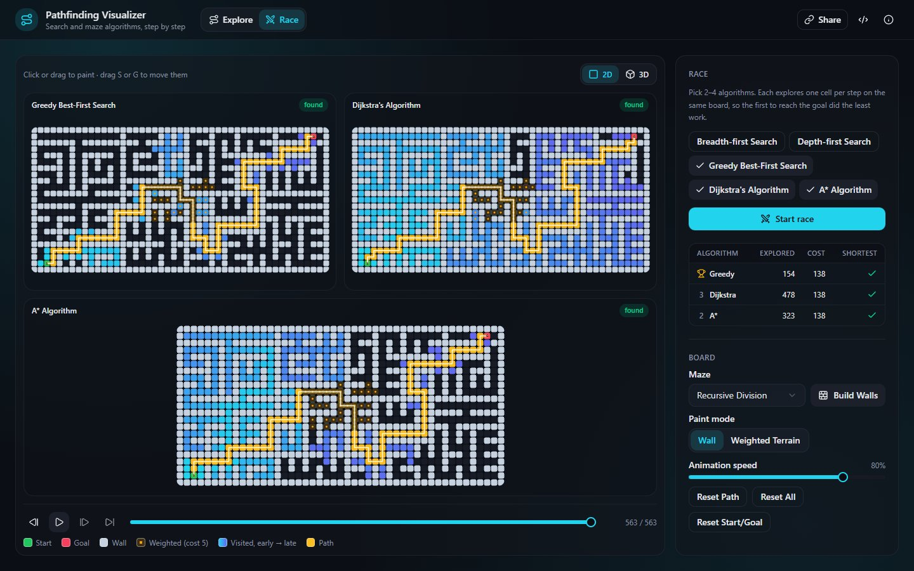
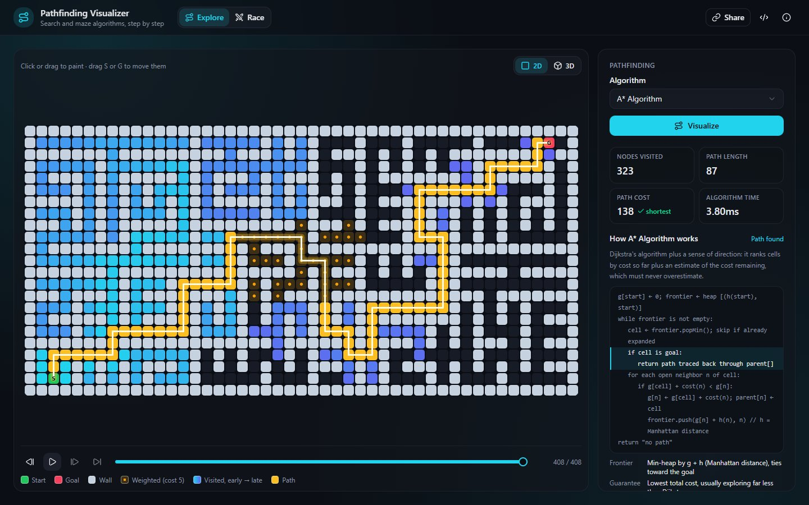
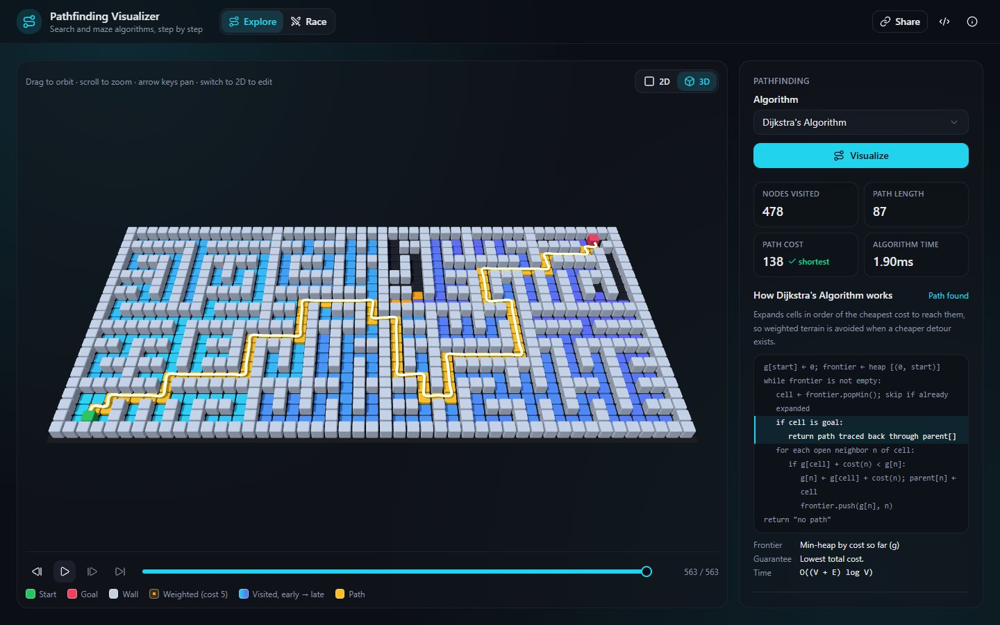

# Pathfinding Visualizer

[](https://github.com/enbattle/pathfinding-visualizer/actions/workflows/ci.yml)

**[Try it live](https://enbattle.github.io/pathfinding-visualizer/)**: watch search algorithms explore a maze step by step, race them side by side, and view any run in 3D.



Welcome to my Pathfinding Visualizer! In a recent pursuit, I had been exposed to the world of AI path-finding, search, and wall-building. After that exposure, I decided that I need to explore the topic further, and solidify my understanding by building an app. I will continuously add to the application with more algorithms. In the meantime, please take a look and have fun!

| Explore, with the algorithm's pseudocode                                                                             | The same run in 3D                                                                                                                           |
| -------------------------------------------------------------------------------------------------------------------- | -------------------------------------------------------------------------------------------------------------------------------------------- |
|  |  |

## Engineering highlights

- **A pure-TypeScript engine** (`src/engine/`): typed-array grids; all five searches as one generator loop that differs only by a small spec; seeded, reproducible mazes.
- **Property-based testing against naive reference solvers.** These found a real bug: the original A* wasn't guaranteed to find the cheapest path. An independent audit's widened properties then caught mazes walling in markers on the border. Both are fixed and regression-tested.
- **Playback as data:** every run is precomputed as per-cell reveal ticks, so pause, step, scrub, speed and side-by-side races are just a playhead, with no timers to cancel.
- **Rendering:** one canvas per board, drawn as a pure function of (board, run, tick) with batched fills; a lazily loaded three.js view (one `InstancedMesh` draw call) that 2D-only visitors never download.
- **Untrusted input handled strictly:** share links are fuzz-tested and never throw; a build-time Content Security Policy.
- **Tests at every level:** 190+ unit, property and component tests; Playwright end-to-end tests on the production build (canvas-color assertions, WebGL, CSP, axe accessibility checks); bundle-size budgets; SHA-pinned CI; a docs check that fails the build when docs reference code that no longer exists.

Design notes: [docs/architecture.md](docs/architecture.md) and [docs/decisions.md](docs/decisions.md).

## Features

- **Explore**: watch one algorithm search, with its pseudocode highlighted
  step by step, live stats, and a check of whether its path is the
  cheapest possible.
- **Race**: run 2–4 algorithms side by side on the same board, one cell
  per step each, with live standings: who reached the goal with the least
  work, and whose path is actually shortest.
- **Playback**: pause, step, and scrub any run forwards or backwards.
- **Live editing**: paint walls and weighted terrain, drag start/goal, or
  generate a maze; once a path is shown, edits update it instantly.
- **Share**: copy a link that reopens the exact board and replays the run.
- **3D view**: watch any run (or race) as a 3D scene. Walls rise, visited
  cells ripple, and the path glows; orbit and zoom freely. It loads only
  when you open it.
- **Accessible**: the board is keyboard-operable (arrow keys, Space) and
  announces the cell under the cursor to screen readers; animations
  respect `prefers-reduced-motion`.

## Current Pathfinding Algorithm Selection

- Dijkstra's Algorithm
- A* Algorithm
- Greedy Best-First Search
- Breadth-first Search
- Depth-first Search

## Current Wall-Building Algorithm Selection

- Recursive Division
- Twin Recursive Division
- Prim's Algorithm

## Development

Requires Node 22.22.2+, 24.15+ or 26+ (the range jsdom 30, used by the unit
tests, supports).

```bash
npm install
npm run dev          # local dev server
npm run lint         # ESLint
npm run format       # Prettier (write); format:check verifies only
npm run typecheck    # tsc
npm run test:run     # Vitest unit + component tests (npm test for watch mode)
npm run build        # production bundle in dist/
npm run check:bundle # bundle size budgets (after build)
npm run test:e2e     # Playwright end-to-end tests against the production build
npm run bench        # engine benchmarks
npm run check:docs   # docs only reference paths/scripts/identifiers that exist
npm run verify       # all of the fast checks in one go (what CI's verify job runs)
npm run verify:full  # verify + the end-to-end tests
npm run assets       # regenerate README screenshots, link-preview image and icons
```

The first time you run the e2e tests, install their browser with
`npx playwright install chromium`.

## Architecture

The algorithms live in a pure-TypeScript engine (`src/engine/`) that the
React UI only animates. It is tested with property-based tests against
naive reference solvers, plus readable ASCII snapshot tests. See
[docs/architecture.md](docs/architecture.md).

## Deployment

Every pull request and push to `main` runs `.github/workflows/ci.yml`:
formatting, lint (zero warnings), typecheck, the docs check, unit tests, a
production build with bundle budgets, `npm audit`, Playwright end-to-end
tests (report uploaded as an artifact), and engine benchmarks (shown in the
run summary).

When CI passes for a push to `main`, `.github/workflows/deploy.yml` builds
exactly that commit, without a dependency cache, and publishes it to GitHub
Pages via `actions/deploy-pages`. Nothing CI rejected can ship. It can also
be run by hand from the Actions tab (`workflow_dispatch`).

Dependabot opens grouped weekly update PRs for npm packages and for the
SHA-pinned GitHub Actions. See [SECURITY.md](SECURITY.md) for reporting
vulnerabilities.
